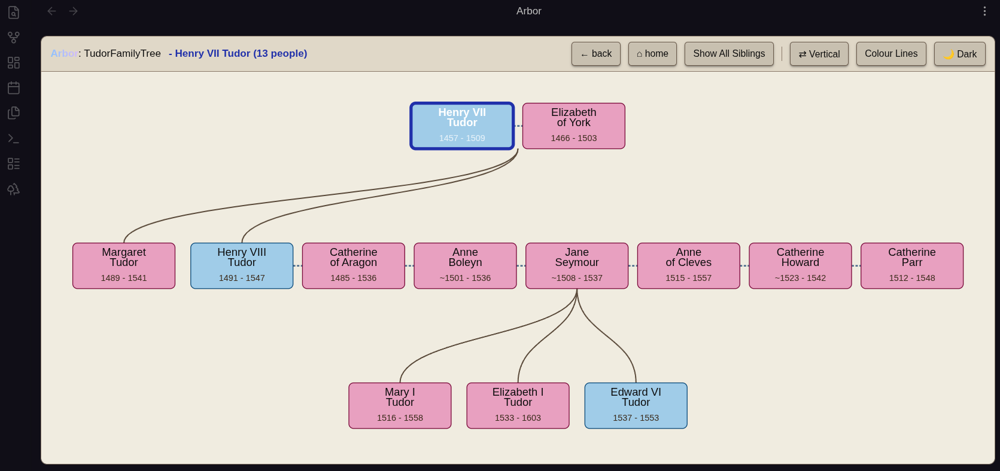
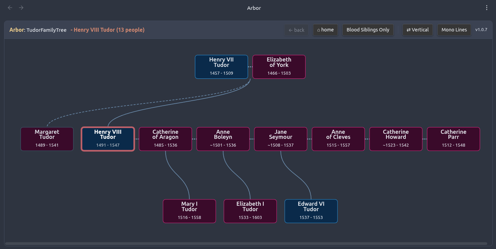

# Arbor Family Tree

An Obsidian plugin for building, visualising, and exporting a family tree stored as Markdown notes in your vault.

Arbor grew out of a personal project to easily visualise my own family history. It is not designed to be a canonically correct genealogical tool — it is optimised for practical, everyday use by someone who wants to keep family records in Obsidian and share them with non-technical family members. (And hopefully, to look pretty). If you have similar motivations, it may suit you well.





---

## Features

- **Interactive tree view** — visualise your family tree as a navigable SVG diagram, rooted on any person
- **Dark and light themes**
- **Horizontal and vertical layout modes**
- **Colour-coded edges** — edges from the same parent cycle through a muted colour palette to help trace individual lines; toggle between coloured and monochrome at any time
- **Siblings toggle** — show blood-line siblings only, or all siblings including married-in relatives
- **Persistent session state** — toolbar settings and last-viewed person are remembered between sessions
- **Create Person Note** — modal command to add a new person note with the correct frontmatter
- **Import People from CSV** — bulk-create person notes from a CSV file, with dry-run preview
- **Export Tree as HTML** — generates a fully self-contained, interactive HTML file for sharing with anyone
- **Export Tree as GEDCOM** — exports to GEDCOM 5.5.1 for use with genealogy applications such as Gramps

---

## Known limitations

- **Pedigree collapse is not supported.** If a person appears in two separate lines of descent from the root — for example, because cousins married, or because a common ancestor appears on both sides of the family — one of the connecting relationships will not be drawn. This affects closely-knit historical families, noble lineages where cousin marriage was common, and mythological or legendary genealogies. Viewing the tree from a different root person (one who sits on only one of the two paths) will usually give a cleaner result. When pedigree collapse is detected, the **Show All Siblings** toolbar button is automatically disabled — hovering over it will show a tooltip explaining why.
- The **show all siblings** mode can produce overlapping cards in some multi-generation configurations. Blood-siblings-only mode works correctly in all cases.
- GEDCOM export has been tested with Gramps only.

---

## Installation

### From the Obsidian community plugin browser (recommended)

1. Open **Settings → Community plugins → Browse**
2. Search for **Arbor Family Tree**
3. Install and enable

### Manual installation

1. Download `main.js` and `manifest.json` from the [latest release](https://github.com/DisparateDan/arbor/releases)
2. Copy them to `<your vault>/.obsidian/plugins/arbor-family-tree/`
3. Enable the plugin in **Settings → Community plugins**

---

## Example

An example family tree using the Tudor dynasty is included in the `example/People/` folder of this repository. Copy that folder into your Obsidian vault and open any of the notes to load the tree — Henry VIII's six marriages and three children with different mothers make for a good demonstration of the plugin's layout.

---

## Getting started

### 1. Create your first person note

First, create a folder in your vault to hold your person notes (e.g. `FamilyTree/People`). Person notes must live in a folder — notes in the vault root will not be detected by the plugin.

Then run **Arbor Family Tree: Create Person Note** from the command palette with any person note active, or with your people folder open. You will be prompted for a first name and family name. Arbor will create a note with the correct frontmatter in the same folder as the active note.

Alternatively, create a note manually in your people folder using the schema below.

### 2. Open the tree view

Click the tree icon in the ribbon, or run **Arbor Family Tree: Open Tree View** from the command palette. On first use the tree roots on whichever person note is currently active. After that, the ribbon icon restores the last-viewed person and all toolbar settings automatically.

### 3. Navigate

- **Click any card** to re-root the tree on that person and re-draw the tree
- **← Back** returns to the previous root
- **⌂ Home** returns to the person who was active when the tree was loaded
- **Show All Siblings / Blood Siblings Only** toggles sibling display mode
- **Colour Lines / Mono Lines** toggles between colour-coded and monochrome edges
- **⇄ Vertical / ↕ Horizontal** switches layout orientation
- **☀ Light / 🌙 Dark** switches colour theme

---

## A note on sibling display modes
The default view mode shows blood siblings only, and those connected only by marriage will be omitted. When toggled to include siblings (in-laws) connected by marriage the layout can get complicated and lose clarity for large familes.

## Person note schema

Each person is a single Markdown file. The filename can be anything, but Arbor uses the file stem as the person's identifier — the convention is `First Last_xxxx.md` where `xxxx` is a short random suffix to keep filenames unique.

```yaml
---
ar_type: person          # required — marks this note as a person record
first_names:             # given name(s)
family_name:             # surname
sex:                     # male | female  (blank = unknown)
DOB:                     # year (1923), approximate (~1923, c.1923), or YYYY-MM-DD
DOD:                     # same formats as DOB
birthplace:
married: []              # list of wikilinks to spouse note stems
father:                  # wikilink to father's note stem
mother:                  # wikilink to mother's note stem
---
```

All fields except `ar_type` are optional. Arbor will render whatever is present.

### Wikilink format

Relationships use standard Obsidian wikilinks:

```yaml
father: "[[John Smith_ab12]]"
mother: "[[Mary Jones_cd34]]"
married:
  - "[[Jane Doe_ef56]]"
```

---

## Multiple trees

Arbor supports multiple independent family trees in one vault. Place each tree's person notes under a different top-level folder (e.g. `FamilyTree/People` and `AnotherTree/People`). Arbor uses the top-level folder name as the tree's identity and will prompt you to choose if it detects more than one tree.

---

## Exporting

### HTML export

Run **Arbor Family Tree: Export Tree as HTML** to generate a standalone HTML file saved to your vault root. The file is fully self-contained — no internet connection required — and can be shared with anyone who has a web browser. It includes the full interactive toolbar (navigation, theme toggle, layout toggle, colour lines toggle) and renders with coloured edges enabled by default.

### GEDCOM export

Run **Arbor Family Tree: Export Tree as GEDCOM** to generate a GEDCOM 5.5.1 `.ged` file, compatible with genealogy applications such as Gramps. The exporter covers individuals, birth/death dates and places, and family units derived from parent and spouse fields.

---

## Contributing

This project is intentionally kept simple — it's a personal visualisation tool, not a full genealogical application, and I'd like it to stay that way. PRs that add significant complexity in pursuit of correctness or completeness probably aren't a good fit, but bug fixes, performance improvements, and modest UX enhancements are very welcome.

Please open an issue before starting significant work so we can discuss the approach. All PRs must pass the CI checks (type check, tests, and build) before review. If you are fixing a bug or adding a feature, please include or update tests for the affected pure logic in `plugin/src/__tests__/`.

This plugin was developed with the assistance of Claude (Anthropic).

## License

MIT — see [LICENSE](LICENSE).
